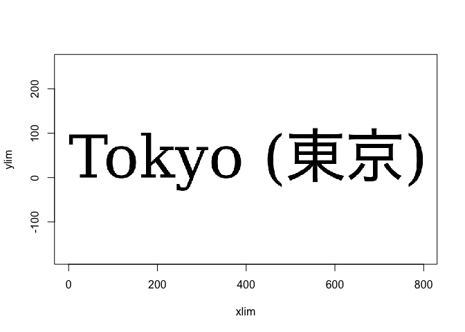

<!-- README.md is generated from README.Rmd. Please edit that file -->

# rasterText

<!-- badges: start -->

<!-- badges: end -->

The main goal of `rasterText` is to support drawing text in the `rgl`
package, but it should be usable by other packages that need to render
text to a raster. This can be done through R code or by direct calls to
the underlying C code.

It does just a few things: given a vector of strings and font
descriptions in the format used by `rgl` (which is very similar to what
base R graphics uses), it can:

1.  Measure the strings in terms of pixels.
2.  Pack the strings into a single rectangular region.
3.  Render the strings into a rectangular raster.
4.  Alternatively, break up the strings into individual glyphs, and pack
    those into a rectangular raster atlas.
5.  Draw text by extracting each glyph from the atlas.

## Installation

You can install the development version of rasterText from
[GitHub](https://github.com/) with:

``` r
# install.packages("pak")
pak::pak("dmurdoch/rasterText")
```

## Example

Here is a simple example:

``` r
library(rasterText)

text <- c("abc", "Tokyo (\u6771\u4eac)", "\u6771\u4eac", "abc")

family <- "serif"
font <- 1
cex <- 5

m <- measure_text(text, family, font, cex = cex)
m
#>      height width x_advance x_bearing y_advance y_bearing ascent descent
#> [1,]     77   172       180         4         0       -76     93      24
#> [2,]    107   599       606         0         0       -85     93      24
#> [3,]     93   194       200         2         0       -90     93      24
#> [4,]     77   172       180         4         0       -76     93      24
#>      baseline
#> [1,]       93
#> [2,]       93
#> [3,]       88
#> [4,]       93
p <- pack_text(text, m, max(m[, "width"]))
p
#>        x   y
#> [1,]  -3 -16
#> [2,]   1  87
#> [3,] 172  -2
#> [4,]  -3 -16
#> attr(,"width")
#> [1] 599
#> attr(,"height")
#> [1] 203
raster <- draw_text_to_raster(text, family, font, cex = cex, measure=m, pack=p)
plot(raster)
```


``` r

a <- glyphAtlas(text, family, font, cex = cex, monochrome = FALSE)
a
#> Glyph atlas:
#>   color buffer size 512 x 512
#>   2 fonts
#>   12 glyphs
#>   3 strings
plot(a)
```


``` r

# Render just the second string
renderFromAtlas(a, 2)
```


